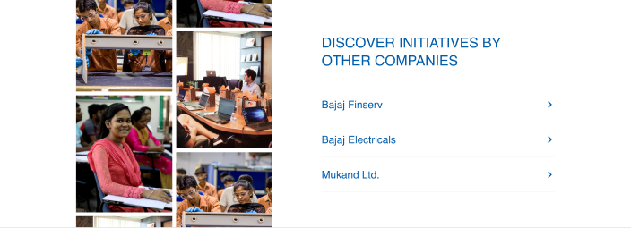

# 📎 Classification Data

### **Frontend**

<figure><figcaption></figcaption></figure>

<figure><figcaption></figcaption></figure>

<figure><figcaption></figcaption></figure>

### Backend (CMS)

<figure><figcaption></figcaption></figure>
