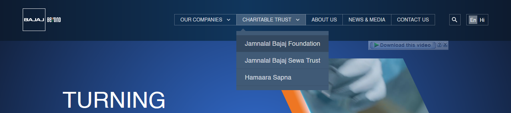
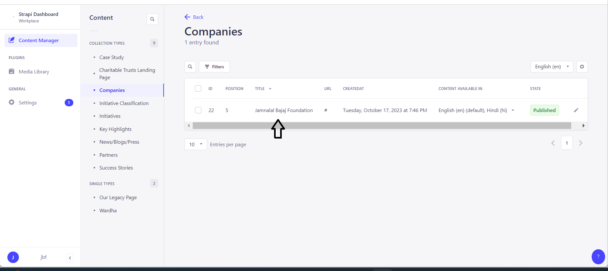

# Charitable Trust Landing Page

There are three charitable trusts listed on the charitable trust page by default.

* Jamnalal Bajaj Foundation
* Jamnalal Bajaj Sewa Trust
* Hamaara Sapna

To assess a charitable trust page in frontend you need to select a charitable trust from the header navigation of the website.&#x20;

<figure><figcaption>
 charitable trust dropdown
</figcaption></figure>

Backend(CMS)

<figure><figcaption>
 charitable trust dropdown
</figcaption></figure>
